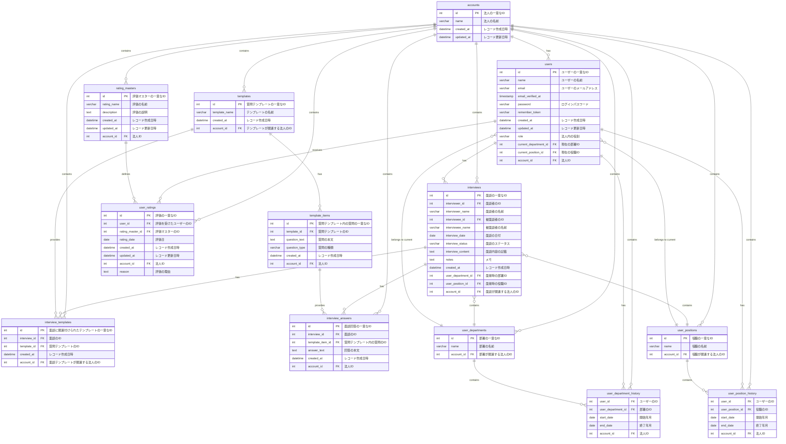

# OneOnOneについて

# 開発環境の構築方法

# 動作方法

# ER図

```mermaid
erDiagram

    accounts {
        int id PK "法人の一意なID"
        varchar name "法人の名前"
        datetime created_at "レコード作成日時"
        datetime updated_at "レコード更新日時"
    }

    users {
        int id PK "ユーザーの一意なID"
        varchar name "ユーザーの名前"
        varchar email "ユーザーのメールアドレス"
        timestamp email_verified_at ""
        varchar password "ログインパスワード"
        varchar remember_token ""
        datetime created_at "レコード作成日時"
        datetime updated_at "レコード更新日時"
        varchar role "法人内の役割"
        int current_department_id FK "現在の部署ID"
        int current_position_id FK "現在の役職ID"
        int account_id FK "法人ID"
    }
    
    interviews {
        int id PK "面談の一意なID"
        int interviewer_id FK "面談者のID"
        varchar interviewer_name "面談者の名前"
        int interviewee_id FK "被面談者のID"
        varchar interviewee_name "被面談者の名前"
        date interview_date "面談の日付"
        varchar interview_status "面談のステータス"
        text interview_content "面談内容の記載"
        text notes "メモ"
        datetime created_at "レコード作成日時"
        int user_department_id FK "面接時の部署ID"
        int user_position_id FK "面接時の役職ID"
        int account_id FK "面談が関連する法人のID"
    }
    
    templates {
        int id PK "質問テンプレートの一意なID"
        varchar template_name "テンプレートの名前"
        datetime created_at "レコード作成日時"
        int account_id FK "テンプレートが関連する法人のID"
    }
    
    template_items {
        int id PK "質問テンプレート内の質問の一意なID"
        int template_id FK "質問テンプレートのID"
        text question_text "質問の本文"
        varchar question_type "質問の種類"
        datetime created_at "レコード作成日時"
        int account_id FK "法人ID"
    }

    interview_templates {
        int id PK "面談に関連付けられたテンプレートの一意なID"
        int interview_id FK "面談のID"
        int template_id FK "質問テンプレートのID"
        datetime created_at "レコード作成日時"
        int account_id FK "面談テンプレートが関連する法人のID"
    }

    interview_answers {
        int id PK "面談回答の一意なID"
        int interview_id FK "面談のID"
        int template_item_id FK "質問テンプレート内の質問のID"
        text answer_text "回答の本文"
        datetime created_at "レコード作成日時"
        int account_id FK "法人ID"
    }
    
    user_departments {
        int id PK "部署の一意なID"
        varchar name "部署の名前"
        int account_id FK "部署が関連する法人のID"
    }

    user_positions {
        int id PK "役職の一意なID"
        varchar name "役職の名前"
        int account_id FK "役職が関連する法人のID"
    }

    user_department_history {
        int user_id FK "ユーザーのID"
        int user_department_id FK "部署のID"
        date start_date "開始年月"
        date end_date "終了年月"
        int account_id FK "法人ID"
    }

    user_position_history {
        int user_id FK "ユーザーのID"
        int user_position_id FK "役職のID"
        date start_date "開始年月"
        date end_date "終了年月"
        int account_id FK "法人ID"
    }
    
    rating_masters {
        int id PK "評価マスターの一意なID"
        varchar rating_name "評価の名前"
        text description "評価の説明"
        datetime created_at "レコード作成日時"
        datetime updated_at "レコード更新日時"
        int account_id FK "法人ID"
    }
    
    user_ratings {
        int id PK "評価の一意なID"
        int user_id FK "評価を受けたユーザーのID"
        int rating_master_id FK "評価マスターのID"
        date rating_date "評価日"
        datetime created_at "レコード作成日時"
        datetime updated_at "レコード更新日時"
        int account_id FK "法人ID"
        text reason "評価の理由"
    }

    accounts ||--o{ users : "has"
    accounts ||--o{ interviews : "contains"
    accounts ||--o{ templates : "contains"
    accounts ||--o{ interview_templates : "contains"
    accounts ||--o{ interview_answers : "contains"
    accounts ||--o{ user_departments : "contains"
    accounts ||--o{ user_positions : "contains"
    accounts ||--o{ user_department_history : "contains"
    accounts ||--o{ user_position_history : "contains"
    accounts ||--o{ rating_masters : "contains"
    accounts ||--o{ user_ratings : "contains"
    
    users ||--o{ interviews : "has"
    users ||--o{ user_department_history : "has"
    users ||--o{ user_position_history : "has"
    users ||--o{ user_ratings : "receives"
    
    interviews ||--o{ interview_templates : "has"
    interviews ||--o{ interview_answers : "has"
    
    templates ||--o{ template_items : "has"
    templates ||--o{ interview_templates : "provides"
    
    template_items ||--o{ interview_answers : "provides"
    
    user_departments ||--o{ user_department_history : "contains"
    user_positions ||--o{ user_position_history : "contains"
    
    rating_masters ||--o{ user_ratings : "defines"
    
    interviews }o--|| user_departments : "contains"
    interviews }o--|| user_positions : "contains"
    
    users }o--|| user_departments : "belongs to current"
    users }o--|| user_positions : "belongs to current"

```